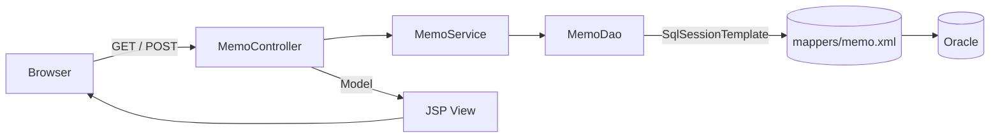
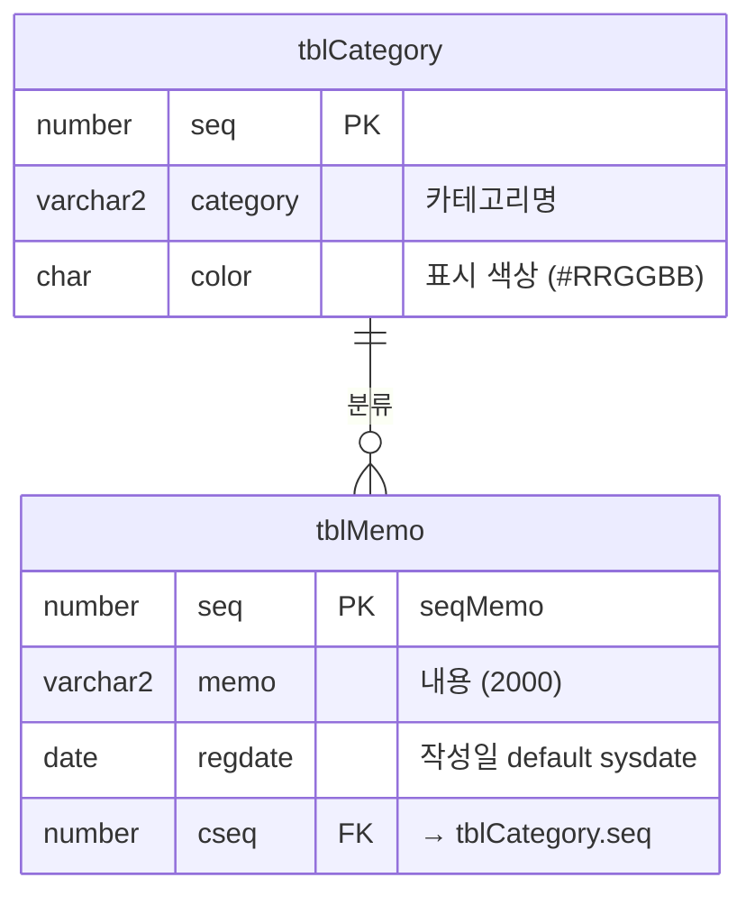

# 📝 Spring Memo

> 카테고리별 색상으로 구분되는 **카드형 메모장** 웹 애플리케이션  
> Spring MVC + MyBatis + Oracle로 **Controller → Service → DAO → Mapper** 계층을 직접 구성하며 CRUD 전 과정을 구현했습니다.

<br>

## 📌 프로젝트 개요

| 항목 | 내용 |
|---|---|
| 개발 형태 | 개인 프로젝트 (쌍용교육센터 Java Full-Stack 과정 실습) |
| 목적 | Spring MVC 계층 구조와 MyBatis 연동 흐름 익히기 |
| 핵심 기능 | 메모 목록 · 작성 · 수정 · 삭제 (CRUD) + 카테고리 분류 |

<br>

## 🛠 기술 스택

| 구분 | 사용 기술 |
|---|---|
| **Language** | Java 11 |
| **Framework** | Spring MVC 5.3 |
| **Persistence** | MyBatis 3.5, MyBatis-Spring 2.1, HikariCP, log4jdbc |
| **Database** | Oracle XE 21c (ojdbc11) |
| **View** | JSP, JSTL, jQuery |
| **Build / Tool** | Maven, STS3, Tomcat 9 |
| **Etc** | Lombok, Logback |

<br>

## ✨ 주요 기능

### 1. 메모 목록 (`/`)
- 메모를 **카드 형태**로 최신순 정렬하여 표시
- 카드 테두리를 **카테고리 색상**으로 표시 (`tblMemo` ⨝ `tblCategory` JOIN)
- 작성일 표시 방식 분기
  - 오늘 작성한 메모 → **시간**만 표시 (`14:32:10`)
  - 어제 이전 메모 → **날짜**만 표시 (`2026-10-02`)
- 줄바꿈(`\r\n`)을 `<br>`로 변환하여 입력한 그대로 출력

### 2. 메모 작성 (`/add.do`)
- DB에서 카테고리 목록을 불러와 `<select>`로 선택
- 시퀀스(`seqMemo`)로 번호 자동 생성, 작성일은 `default sysdate`

### 3. 메모 수정 (`/edit.do`)
- 기존 메모 내용과 카테고리를 폼에 채워서 표시
- 수정 실패 시 해당 메모의 수정 화면으로 되돌아감

### 4. 메모 삭제 (`/del.do`)
- 삭제 확인 화면을 거친 뒤 POST로 삭제 처리

<br>

## 🏗 아키텍처



| 계층 | 클래스 | 역할 |
|---|---|---|
| Controller | `MemoController` | URL 매핑, 파라미터 수신, Model에 결과 담아 JSP 반환 |
| Service | `MemoService` | 날짜 포맷 가공, 줄바꿈 처리 등 비즈니스 로직 |
| Repository | `MemoDao` | `SqlSessionTemplate`으로 Mapper SQL 호출 |
| Model | `MemoDto`, `CategoryDto` | 데이터 전달 객체 (Lombok) |
| Mapper | `memo.xml` | SQL 정의 (list, clist, add, getMemo, edit, del) |

<br>

## 🔗 URL 설계

| Method | URL | 설명 | View |
|---|---|---|---|
| GET | `/` | 메모 목록 | `index.jsp` |
| GET | `/add.do` | 작성 폼 | `add.jsp` |
| POST | `/addok.do` | 작성 처리 | `addok.jsp` |
| GET | `/edit.do?seq={seq}` | 수정 폼 | `edit.jsp` |
| POST | `/editok.do` | 수정 처리 | `editok.jsp` |
| GET | `/del.do?seq={seq}` | 삭제 확인 | `del.jsp` |
| POST | `/delok.do` | 삭제 처리 | `delok.jsp` |

> 처리(`*ok.do`) 결과는 `result`(1 / 0)로 JSP에 전달되며, JSP에서 성공·실패 알림 후 페이지를 이동합니다.

<br>

## 🗄 DB 설계 (ERD)



기본 카테고리: `운동` · `여행` · `코딩` · `휴식` · `학업`

<br>

## 📂 프로젝트 구조

```
spring-memo
├── pom.xml
├── script.sql                              # 테이블 · 시퀀스 · 샘플 데이터
└── src/main
    ├── java/com/test/memo
    │   ├── controller/MemoController.java
    │   ├── service/MemoService.java
    │   ├── repository/MemoDao.java
    │   └── model/{MemoDto, CategoryDto}.java
    ├── resources
    │   ├── config/mybatis-config.xml
    │   ├── config/db.properties.example     # DB 접속 정보 템플릿
    │   └── mappers/memo.xml
    └── webapp/WEB-INF
        ├── spring/root-context.xml          # DataSource · SqlSessionFactory
        ├── spring/appServlet/servlet-context.xml
        └── views/                           # index · add · edit · del (+ *ok) · inc/header
```

<br>

## ▶ 실행 방법

1. **DB 준비**: Oracle XE에 접속해 `script.sql`을 실행합니다.
2. **접속 정보 설정**: `db.properties.example`을 복사해 `db.properties`로 만든 뒤 값을 입력합니다.
   ```properties
   # src/main/resources/config/db.properties
   db.url=jdbc:log4jdbc:oracle:thin:@localhost:1521/XEPDB1
   db.username=YOUR_USERNAME
   db.password=YOUR_PASSWORD
   ```
3. **실행**: STS/Eclipse에서 `Import → Existing Maven Projects`로 불러온 뒤 Tomcat 9에 배포합니다.
4. 브라우저에서 `http://localhost:{포트}/memo/` 로 접속합니다.

<br>

## 💡 배운 점

- **계층 분리의 의미**: Controller는 요청·응답만, Service는 가공 로직만, DAO는 DB 접근만 담당하도록 나누면서 각 계층의 책임을 이해했습니다.
- **MyBatis 연동 흐름**: `HikariCP → SqlSessionFactory → SqlSessionTemplate → Mapper XML` 순서로 연결되는 설정을 직접 구성했습니다.
- **`resultType` 매핑**: JOIN 결과(`category`, `color`)를 하나의 DTO로 받기 위해 `MemoDto`에 필드를 추가하는 방식을 사용했습니다.
- **보안 정보 분리**: DB 비밀번호를 `db.properties`로 분리하고 `.gitignore`로 제외해 저장소에 노출되지 않도록 했습니다.

<br>

## 🔧 개선하고 싶은 점

- [ ] 처리 후 `alert` + JSP 이동 대신 **PRG 패턴**(`redirect:`) + `RedirectAttributes`로 메시지 전달
- [ ] 작성자 표시가 고정값이라 **로그인 기능**을 붙여 실제 작성자 표시
- [ ] 메모 내용 출력 시 **XSS 방지**(`<c:out>` 또는 `fn:escapeXml`) 적용
- [ ] 카테고리별 **필터링 / 검색** 기능 추가
